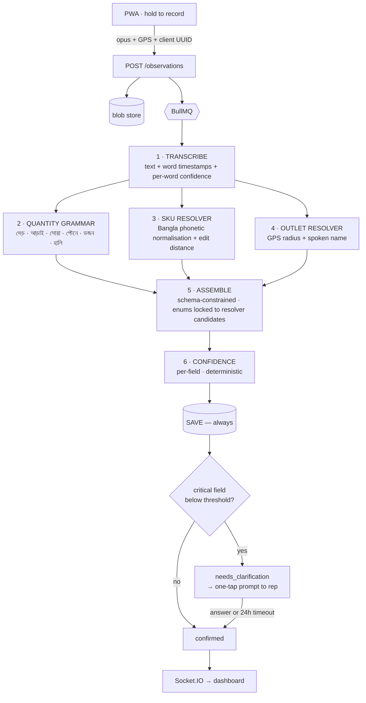

<div align="center">

# Muse

**Bangla voice → structured field intelligence.**

*A field representative speaks for fifteen seconds. It becomes data a brand manager can act on.*

`Status: in active development` · `Target: 30 August 2026`

</div>

---

## The problem

FMCG companies in Bangladesh — ACI, BAT, Unilever, PRAN — run field forces of hundreds of
distribution reps, each visiting 30–50 retail outlets a day. Their sales-force-automation apps
capture **orders** perfectly well.

They capture the **reason** for nothing.

A rep in Mirpur sees a competitor promo running in twelve shops on a Tuesday. The brand manager
finds out in October, from a sales dip. Typing three sentences of context across forty outlets a
day is impossible, so nobody does it — and the most valuable data in the field dies on the road.

**Fifteen seconds of voice is not impossible.**

Muse turns a Bangla voice note into structured, queryable field intelligence: competitor promos,
stock-outs, price changes, retailer complaints, demand signals.

---

## What it does

A rep says:

> *"বিজয় স্টোরে প্রাণ ম্যাঙ্গো জুস দেড় ডজন লাগবে, আর হুইল এর নতুন অফার দিছে, পাঁচ টাকা কম"*

Muse produces:

```json
[
  { "type": "demand_signal",   "outlet_id": "OUT-1182", "sku": "SKU-404",
    "quantity": 18, "unit": "piece", "severity": "medium" },

  { "type": "competitor_promo", "outlet_id": "OUT-1182", "sku": null,
    "competitor_brand": "COMP-WHEEL", "price_delta": -5, "severity": "high" }
]
```

Note `দেড় ডজন` → `18`. One recording, two distinct observations, an outlet resolved from GPS plus
a spoken name, and a product resolved against a catalogue.

---

## The technical thesis

Published Bengali ASR benchmarks report word error rates around 3–5%. **Those numbers do not apply
here.** They are measured on clean, read, studio speech. Real audio for this product is a rep
standing in a market with traffic, a ceiling fan, and a shopkeeper talking over him. Published
long-form Bangla benchmarks put word error rates near **34%**.

So Muse is built on an inversion:

> **The transcript does not need to be right. The _fields_ need to be right.**

Accuracy is recovered by a deterministic layer — a Bangla quantity grammar and closed-catalogue
phonetic resolvers — *not* by hoping for a better ASR model. The language model never sees an open
field: it selects from candidates the deterministic stages have already produced.

**The LLM is not a converter. It is a selector operating inside a box the deterministic stages
built for it.**

This is why the target metric is field-level accuracy, not word error rate, and why the two are
expected to diverge sharply.

---

## Pipeline



### Two invariants

1. **Stages annotate; they never rewrite the transcript.** The original text flows through
   untouched and each stage appends annotations carrying character spans back into it. A stage that
   rewrote text and got it wrong would leave nothing downstream able to recover.
2. **Stages 2, 3 and 4 are independent.** All three read the same transcript. Quantities do not
   depend on products; products do not depend on outlets.

### Why a hallucinated product is structurally impossible

Stage 5 receives a Zod schema whose identity fields are **enums built per-request** from that
clip's resolved candidates:

```ts
sku: z.enum(["SKU-404", "SKU-407"]).nullable()   // ← produced by stage 3, this clip only
```

The same object generates both the runtime validator and the model's response schema, so the two
cannot drift. The model is free to do what deterministic code is bad at — segmentation and
semantics — and structurally prevented from inventing an identifier.

### Confidence is derived, never self-reported

```
field_conf = asr_conf(span) × resolver_margin × grammar_hit × source_penalty
```

Language models are poorly calibrated and will report high confidence on invented values. Muse
computes confidence from upstream signals instead, and treats the top-1/top-2 resolver margin as a
first-class input: a high score with a low margin means *ambiguous*, not *confident*.

**Low confidence never discards data.** It sets a status. A dropped observation is unsellable into
an enterprise; a flagged one is fine.

---

## Third-party services

Disclosed in full.

| Component | Third-party | Notes |
|---|---|---|
| Speech recognition | ✅ | Free-tier hosted ASR, or `whisper.cpp` running locally |
| Assembly (stage 5) | ✅ | One structured-output call per clip |
| Quantity grammar | ❌ ours | Bangla numerals incl. দেড় · আড়াই · সোয়া · পৌনে · ডজন · হালি · কুড়ি |
| Bangla phonetic normaliser | ❌ ours | Collapses শ/ষ/স → `s`, ণ/ন → `n`, র/ড়/ঢ় → `r`, … |
| SKU / outlet resolvers | ❌ ours | phonetic + edit distance + geo |
| Confidence scoring | ❌ ours | deterministic |
| Orchestration, tracing, evaluation | ❌ ours | |

Every differentiating component is ours. The ASR adapter can run fully local, which means field
data need never leave the customer's infrastructure.

---

## Stack

**Express · TypeScript · MongoDB · Zod · Redis · BullMQ · React + Vite (PWA) · Socket.IO**

- **BullMQ over RabbitMQ** — Redis-backed, so one fewer service; retries, backoff and delayed jobs
  are built in, which makes the 24-hour clarification timeout a scheduling option rather than a cron.
- **Native MongoDB driver, not Mongoose** — Zod already owns the document shape; a second schema
  layer would be a second source of truth.
- **Zod three times over** — static types via `z.infer`, the model's response schema via
  `zod-to-json-schema`, and runtime validation at every boundary.
- **No DI container** — a single composition root. Production wires real adapters, tests wire fakes,
  and a stage test constructs the stage directly with nothing at all.

---

## Structure

```
muse/
├── shared/                      # Zod schemas — the contract between frontend and backend
├── frontend/                    # React + Vite PWA (offline queue, hold-to-record)
└── backend/
    ├── src/
    │   ├── pipeline/            # never imports adapters/ or db/
    │   │   ├── ports/           # IAsrProvider, ILlmProvider, ICatalogRepo, IOutletRepo
    │   │   ├── stages/01..06/   # each: index · types · test · fixtures/
    │   │   ├── orchestrator.ts
    │   │   └── trace.ts         # per-clip, per-stage I/O dumps
    │   ├── adapters/            # asr · llm · storage — each with a fake for tests
    │   ├── queue/ ingest/ observations/ clarification/ review/ catalog/ realtime/
    │   └── container.ts         # composition root
    ├── eval/                    # metrics, deliberately not tests
    ├── datasets/                # clips · labels · catalog
    └── tests/{contract,integration}/
```

---

## Testing

Five tiers, and the distinction between the last two is deliberate.

| Tier | Scope | Dependencies | Runs |
|---|---|---|---|
| 0 · Unit | quantity grammar, phonetic encoder, confidence maths | none | on save |
| 1 · Stage | each stage over committed `input → expected` fixtures | fakes | on save |
| 2 · Contract | one shared suite every adapter must pass | live APIs | nightly |
| 3 · Integration | orchestrator end to end | fakes | CI |
| 4 · **Evaluation** | field accuracy over the labelled set | live APIs | before any change to prompts, code or catalogue |

**Tiers 0–3 are tests** — deterministic, pass or fail. **Tier 4 is an evaluation** — stochastic,
producing metrics gated against the previous snapshot. Conflating the two produces a flaky suite
that eventually gets switched off.

Fake adapters replay recorded provider responses, which is how a stochastic component gets
deterministic tests.

---

## Status

The pipeline runs end to end on live speech and language models: 412 tests, ~13,650 lines,
both capture modalities. Two things are honestly unfinished, and both are stated here
rather than discovered.

| | |
|---|---|
| ✅ | Walking skeleton — capture → pipeline → database → dashboard |
| ✅ | Stage 2 · Bangla quantity grammar (দেড় · আড়াই · সোয়া · পৌনে · ডজন · হালি) |
| ✅ | Stages 3–4 · phonetic SKU resolver, GPS + spoken-name outlet resolver |
| ✅ | Stage 5 · constrained assembly, response schema rebuilt per clip |
| ✅ | Stage 6 · derived confidence + clarification loop |
| ✅ | PWA recorder with offline IndexedDB queue |
| ✅ | Admin — catalogue import, alias approvals, territories, rep assignment |
| ✅ | Analytics — share of voice, stock-out grid, price erosion, pipeline latency |
| ✅ | Auth — companies, invited reps, role-scoped applications |
| ✅ | Evaluation harness — metrics, calibration, regression gate |
| 🟡 | Photo capture — the pipeline is real, **the handwriting reading is simulated** |
| 🟡 | Labelled evaluation set — collection in progress; see `docs/COLLECTION.md` |
| ⬜ | **A measured accuracy figure.** The harness has never run on real labelled data |
| ⬜ | ASR provider bake-off on domain audio |
| ⬜ | Learned confidence model — blocked on the labelled set, not on design |
| ⬜ | Real OCR. Printed price tags and signage are feasible; handwritten Bangla is not yet |

**No accuracy number exists yet**, and none is quoted anywhere in this repository. The
evaluation harness is built and gated on regression; `datasets/labels/` is where its
input goes. Every metric this project could claim is blocked on fieldwork rather than
on code, which is why collection is the top of the queue rather than features.

**Nobody is using it.** No pilot, no customers. It runs end to end on a demo tenant.

### Deliberately out of scope

Muse is a **capture-and-structure layer**, not a sales-force-automation system. It does not manage
orders, and it is not the system of record for product or outlet master data — those are imported
from the customer's existing systems. The only master data Muse owns is the phonetic alias table,
which is precisely the layer no existing system provides.

Version one targets **Dhaka-standard Bangla**. Chittagonian and Sylheti are effectively different
languages for the purposes of speech recognition and are explicitly not supported yet.

---

<div align="center">
<sub>Built in Dhaka.</sub>
</div>
